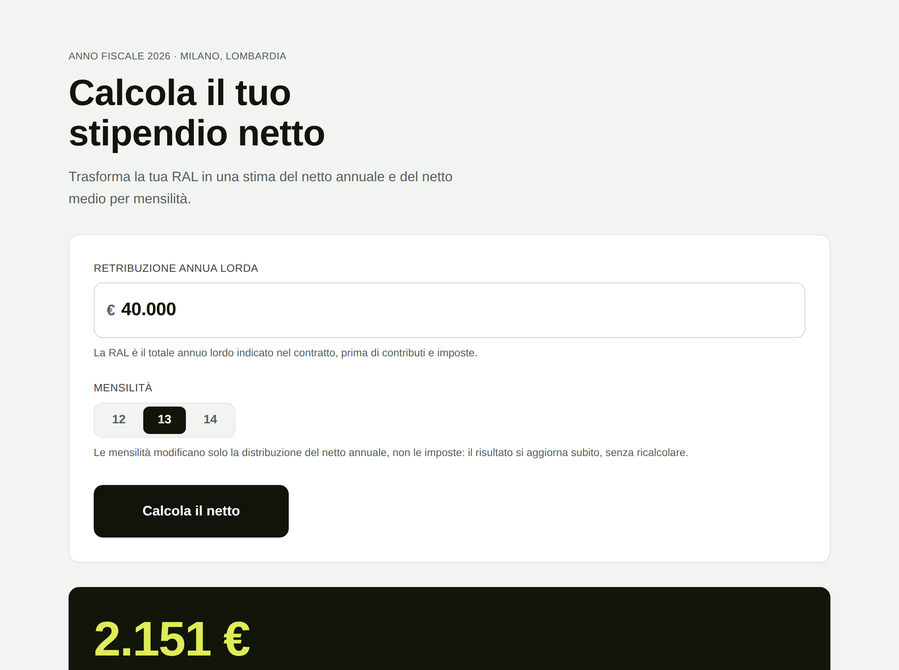
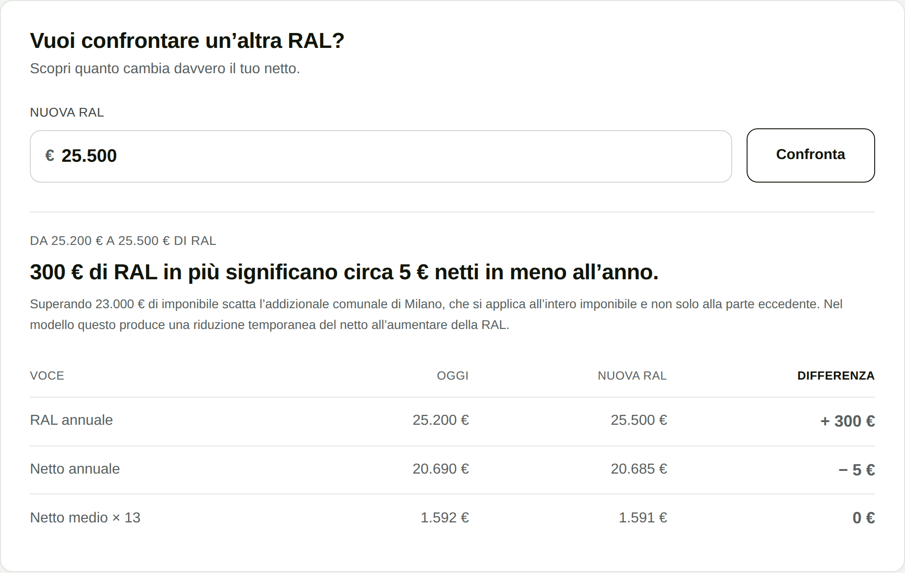

# Jet HR — RAL → Netto Calculator

Un prototipo per stimare il netto annuale e medio per mensilità a partire dalla
RAL, rendendo visibili imposte, contributi e assunzioni utilizzate nel calcolo.

**Caso supportato**

- anno fiscale 2026
- dipendente a tempo indeterminato
- residente a Milano
- 12, 13 o 14 mensilità

Il progetto privilegia semplicità, trasparenza e verificabilità rispetto alla
copertura completa del dominio payroll.

---

## Demo

Il modo più rapido per vederlo, senza installare niente: aprire
**`dist/standalone.html`** con un doppio clic. È l'intera applicazione in un file
solo, generata con `npm run build:standalone`.

In alternativa:

```bash
npm install
npm run dev      # http://localhost:5173
```



---

## 1. Il problema

Una RAL è facile da comunicare ma difficile da tradurre nel valore che interessa
realmente a una persona: *quanto riceverò?*

Il dominio payroll è molto ampio. Ho quindi scelto di non simulare una busta paga
completa, ma di costruire un modello intenzionalmente limitato e comprensibile
per un caso standard.

## 2. Le decisioni di prodotto

**Input minimo.** RAL più 12/13/14 mensilità. Milano, contratto e anno fiscale
sono assunzioni del modello, non campi aggiuntivi. L'obiettivo era evitare che la
complessità del dominio diventasse complessità dell'interfaccia.

**Risposta prima, spiegazione dopo.** Il netto medio per mensilità è il risultato
con maggiore gerarchia. Breakdown fiscale e metodologia sono progressivamente
approfondibili, chiusi di default: nessuno deve superare un esame di fiscalità
italiana prima di sapere quanto prende.

**Trasparenza invece di falsa precisione.** Il prodotto dichiara anno fiscale,
località, assunzioni, componenti escluse e natura stimata del risultato. Il copy
dice «netto medio per mensilità», non «busta paga mensile», perché la
distribuzione reale delle ritenute è un'altra cosa.

**Confronto tra RAL.** Dopo aver risposto a «quanto prendo?», ho esteso lo stesso
modello alla domanda «quanto vale davvero un'altra RAL?», senza introdurre una
seconda logica fiscale: la feature richiama il motore già verificato una seconda
volta e sottrae.

## 3. Come funziona il modello

```
RAL
 ↓
Contributi previdenziali
 ↓
Imponibile fiscale
 ↓
IRPEF
 ↓
Detrazioni
 ↓
Addizionali Lombardia + Milano
 ↓
Netto annuale
 ↓
12 / 13 / 14
 ↓
Netto medio per mensilità
```

Le mensilità non modificano il calcolo fiscale annuale nel modello: modificano
soltanto la distribuzione media del netto. Per questo cambiando 12/13/14 il
risultato si aggiorna all'istante, mentre cambiando la RAL serve ricalcolare.

<details>
<summary><strong>Le formule complete, per chi vuole verificarle</strong></summary>

Tutte le aliquote e le soglie stanno in `src/calculator/taxConfig2026.ts`. Nessun
valore fiscale è scritto altrove.

**Contributi previdenziali**

```
contributi = RAL × 9,19% + max(0, RAL − 56.224) × 1%
imponibile = RAL − contributi
```

**IRPEF lorda** — progressiva per scaglioni, mai per aliquota media:

```
23% fino a 28.000 · 33% da 28.000 a 50.000 · 43% oltre 50.000
```

**Detrazione da lavoro dipendente** (R = imponibile), assumendo rapporto attivo
per l'intero anno:

```
R ≤ 15.000            → 1.955
15.000 < R ≤ 28.000   → 1.910 + 1.190 × (28.000 − R) / 13.000
28.000 < R ≤ 50.000   → 1.910 × (50.000 − R) / 22.000
R > 50.000            → 0
25.000 < R ≤ 35.000   → + 65
```

**Riduzione del cuneo fiscale**, in due componenti distinte. La somma non
imponibile non riduce le imposte: si aggiunge al netto.

```
somma non imponibile      R ≤ 8.500 → R × 7,1% · ≤ 15.000 → 5,3% · ≤ 20.000 → 4,8%
ulteriore detrazione      20.000 < R ≤ 32.000 → 1.000
                          32.000 < R ≤ 40.000 → 1.000 × (40.000 − R) / 8.000
```

**IRPEF netta**

```
max(0, IRPEF lorda − detrazione lavoro − ulteriore detrazione cuneo)
```

**Addizionali**

```
Lombardia   progressiva: 1,23% ≤ 15.000 · 1,58% ≤ 28.000 · 1,72% ≤ 50.000 · 1,73% oltre
Milano      R ≤ 23.000 → 0 · R > 23.000 → R × 0,8% sull'intero imponibile
```

Milano è una **soglia di esenzione, non una franchigia**: superata, l'aliquota si
applica a tutto l'imponibile. È la causa della discontinuità descritta al punto 4.

**Netto**

```
netto annuale = RAL − contributi − imposte + somma non imponibile
netto medio per mensilità = netto annuale / mensilità
```

Nessun arrotondamento nei passaggi intermedi: si arrotonda solo per la
presentazione.

*Scelta di modello da segnalare:* per questo MVP le soglie del cuneo fiscale sono
valutate sull'imponibile `R`, in coerenza con la specifica e con i valori di
riferimento usati nei test. Un motore di produzione userebbe basi diverse per
alcune di esse.

</details>

## 4. Cosa ho scoperto

**Le soglie possono produrre risultati controintuitivi.**

Durante i test ho trovato intervalli nei quali una RAL leggermente superiore può
produrre temporaneamente un netto stimato inferiore. Invece di normalizzare o
nascondere questi risultati, il calculator li mantiene e li segnala nel
confronto, perché derivano dal modello implementato.



Il prodotto non si limita a rilevare l'anomalia: ne nomina la causa. Una funzione
di diagnosi confronta le componenti dei due risultati e individua quale
meccanismo è cambiato — addizionale comunale che scatta, somma non imponibile
che si riduce o cessa, detrazione da lavoro dipendente che si azzera. Non legge
formule: osserva quali voci si sono mosse.

Questo è anche uno dei limiti da considerare nell'interpretazione della stima.

## 5. Testing

Ho trattato il motore fiscale separatamente dalla UI e verificato il
comportamento attraverso test automatici. Coprono:

- benchmark su RAL rappresentative (20k, 30k, 40k, 50k, 70k), con il breakdown
  intermedio completo per due di esse;
- confini degli scaglioni IRPEF;
- soglie delle detrazioni;
- esenzione comunale;
- contributo previdenziale aggiuntivo;
- RAL basse e alte, oltre a input non validi (zero, negativi, NaN, mensilità non
  supportate);
- confronto tra RAL, in entrambe le direzioni;
- casi nei quali il netto non cresce monotonamente.

Suite attuale: 150 test automatici (`npm test`).

## 6. Limiti

**Cosa questo prototipo non è.** Non è un simulatore di cedolino e non vuole
coprire l'intero sistema payroll italiano.

Non considera: CCNL specifici o di settore, situazione familiare e detrazioni
personali, welfare aziendale, fringe benefit, premi, straordinari, assenze, TFR,
trattamento integrativo, conguagli, e la reale distribuzione delle trattenute
nelle singole buste paga.

Il **trattamento integrativo** è escluso deliberatamente: la sua spettanza dipende
da informazioni fiscali personali che un modello con due soli input non può
conoscere.

Ho preferito rendere affidabile e spiegabile un caso limitato invece di aumentare
la copertura con assunzioni che non sarei stata in grado di controllare allo
stesso livello.

## 7. What I'd do next

**Validazione con utenti.** Verificare la comprensione del risultato, del
breakdown e la percezione di affidabilità della stima.

**Maggiore copertura.** Estendere progressivamente località e situazioni
contrattuali, ma solo dopo aver definito come rappresentarne l'incertezza.

**Aggiornabilità.** Rendere più semplice mantenere aliquote e soglie al cambiare
dell'anno fiscale, oggi centralizzate in un unico file ma ancora legate al
codice.

---

<details>
<summary><strong>Appendice tecnica</strong> — architettura, convenzioni, responsive, accessibilità</summary>

### Stack

React, TypeScript, Vite, CSS Modules, Vitest. Nessun backend, nessuna API,
nessuno state management globale: tutto il calcolo avviene client-side.

```bash
npm run dev               # sviluppo
npm test                  # suite completa
npm run build             # typecheck + build in dist/
npm run preview           # serve dist/ su http://localhost:4173
npm run build:standalone  # dist/standalone.html, apribile con un doppio clic
```

> Aprire `dist/index.html` con un doppio clic mostra una pagina bianca: non è un
> errore di build. Il bundle si carica come ES module e i browser bloccano moduli
> e fogli di stile serviti da `file://` (policy CORS, origine `null`). Serve un
> server HTTP, oppure il file standalone.

### Architettura

Quattro livelli separati, con una regola sola: **la UI non contiene formule
fiscali**, e ogni numero mostrato deriva dall'unico oggetto restituito da
`calculateNetSalary`.

```
src/
  calculator/          1. tax configuration + 2. calculation logic
    taxConfig2026.ts     tutte le aliquote e soglie, in un posto solo
    contributions.ts     contributi previdenziali e imponibile
    irpef.ts             tassazione progressiva generica + IRPEF lorda/netta
    deductions.ts        detrazione lavoro dipendente e cuneo fiscale
    localTaxes.ts        addizionale regionale e comunale
    validation.ts        validazione input (ritorna codici, non messaggi)
    calculateNetSalary.ts  unico entry point del motore
  presentation/        3. presentation logic
    breakdown.ts         dal risultato alle righe del breakdown
    composition.ts       dal risultato alle proporzioni della barra
    comparison.ts        differenze fra due risultati + diagnosi delle soglie
    summary.ts           rapporto netto/RAL del blocco risultato
  components/          4. UI
  content/               copy: glossario e assunzioni
  lib/                   formattazione
```

`calculateProgressiveTax` è implementata una volta sola ed è usata sia dall'IRPEF
sia dall'addizionale regionale.

### Convenzione di naming

Il codice è interamente in inglese; la mappatura dei termini italiani è
documentata in testa a `src/calculator/types.ts` — `RAL → grossAnnualSalary`,
`imponibile → taxableIncome`, `mensilità → payments`, `cuneo fiscale →
taxWedge`. Il copy dell'interfaccia resta in italiano.

### Composizione della RAL

La barra risponde a una domanda sola — «dove va la mia RAL?» — quindi i suoi tre
segmenti sommano esattamente alla RAL:

```
RAL = netto derivante dalla RAL + imposte + contributi
```

Il segmento «netto dalla RAL» **esclude** la somma non imponibile del cuneo
fiscale, perché quella si aggiunge alla RAL invece di essere trattenuta:
includerla farebbe descrivere alla barra «RAL + bonus» pur dichiarando di
descrivere la RAL. Il bonus è mostrato come voce separata sotto la barra.
L'invariante è coperto da test.

Ne segue che nel blocco risultato convivono due percentuali diverse ed entrambe
corrette: la frase confronta il netto totale con la RAL, la barra mostra la quota
di RAL che diventa netto. Sopra i 20.000 € di imponibile coincidono; sotto,
differiscono della somma non imponibile e la frase lo dichiara. La regola seguita
è che ogni numero sia esattamente ciò che la sua etichetta dichiara.

### Confronto tra RAL

Lo scenario è **derivato, non memorizzato**: viene ricalcolato dal risultato
principale e dalle mensilità correnti a ogni render, quindi i due scenari non
possono divergere. Cambiare 12/13/14 li aggiorna entrambi; un nuovo calcolo
principale sposta il confronto sulla nuova base.

Il confronto funziona in entrambe le direzioni — 40k → 35k come 40k → 45k — e per
questo si chiama «Confronta RAL», non «Simula aumento».

L'effetto marginale (`netDifference / grossDifference × 100`) rende visibile
quanto vale davvero la differenza senza chiedere all'utente di conoscere
scaglioni e aliquote. Quando la differenza per mensilità arrotonda a zero, la
frase ripiega sul dato annuale: «circa 0 € netti in meno» non sarebbe una frase
accettabile.

### Responsive

Verificato a 320, 360, 390, 768 e 1280 px, con RAL a sei cifre per stressare la
larghezza dei numeri: nessuno scroll orizzontale.

Sotto i 600 px la tabella del confronto lascia il posto a due card compatte più
una card «Differenza»: a quella larghezza il delta conta più del confronto cella
per cella. Le due strutture sono alternative, mai entrambe visibili, quindi uno
screen reader non annuncia mai i numeri due volte.

Sotto i 360 px il layout **cambia struttura**, non si limita a restringersi:
righe del breakdown e voci della legenda passano da due colonne a etichetta sopra
e importo sotto.


Due bug di layout sono nati proprio da questo controllo, entrambi invisibili su
desktop: un campo di testo porta con sé una larghezza intrinseca di circa venti
caratteri, che a 24px di font allargava l'intera pagina oltre il viewport di un
telefono piccolo; e il minimo fisso dato alla CTA per darle presenza su card
larga faceva lo stesso sotto i 360 px.

### Accessibilità

Label associate agli input, error message collegato via `aria-describedby` e
annunciato con `role="alert"`, segmented control costruito su radio native con
navigazione da tastiera, focus state visibile su ogni elemento interattivo, aree
dei risultati con `aria-live="polite"`, tabella del confronto con intestazioni di
riga e di colonna. Nessuna informazione veicolata dal solo colore: ogni segmento
della barra è ripetuto in etichetta, importo e percentuale.

### Formattazione

`Intl.NumberFormat('it-IT')` con `maximumFractionDigits: 0`, più
`useGrouping: 'always'`: il default CLDR per l'italiano non raggruppa i numeri a
quattro cifre, e il netto medio per mensilità sarebbe stato reso come `2151 €`
accanto a `27.960 €`. È una scelta di presentazione, non fiscale.

</details>
